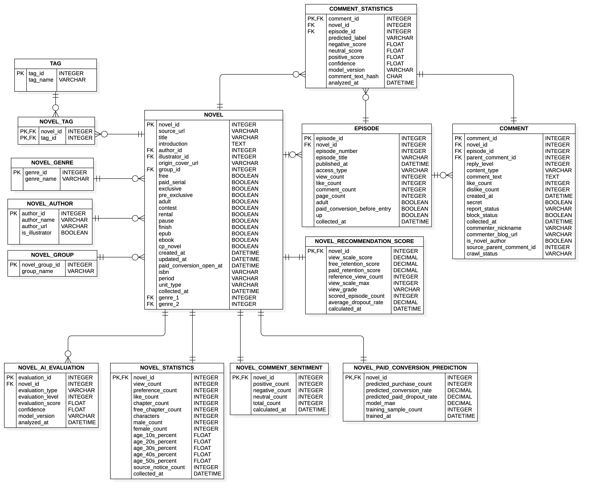

## SKN34-1st-2Team

# 웹소설 분석 및 유료 전환 추천 플랫폼

## 👥 팀 소개
| 윤성호 | 전진환 | 김현지 | 최대원 |
|:----------:|:----------:|:----------:|----------:|
|각자역할작성<br>|<br>|<br>|<br>|
| [GitHub](https://github.com/Seongho-haru) | [GitHub](https://github.com/dfs32dfs) | [GitHub](https://github.com/HJK013) | [GitHub](https://github.com/wind1484) |

## 📋 프로젝트 개요
> 개발 기간 : 2026.08.05 - 2026.08.06 

### 1. 프로젝트명
문피아 웹소설 분석 및 유료 전환 추천 플랫폼 (편집부 분석 서비스)

### 2. 프로젝트 소개
- 문피아 공개 작품·회차 데이터를 기반으로, 편집부 분석 사용자가 무료 작품 중 유료 전환 검토 후보를 탐색하고 반응 감소 작품을 식별할 수 있도록 지원하는 AI 기반 의사결정 지원 대시보드
- 유료 전환 시 예상되는 수익성과 타깃 점수를 산정하여, 객관적인 작품 수익화 여부 결정 지원
- 회차별 독자 이탈률 분석 및 키워드 기반 댓글 감성(긍정/부정/중립) 분류 시각화를 통한 독자 반응 확인 

### 3. 프로젝트 필요성
- 웹소설 시장에서 무료 회차에서 유료 회차로 전환하는 작품 대상을 선택하는 것은 매출에 직결되는 핵심이지만, 기존에는 주관적인 예상에 의존하여 작품을 선별해야 했음
- 객관적인 데이터(회차별 조회수를 기반으로 한 이탈률, 조회/좋아요/댓글수와 댓글 감성과 같은 독자 반응, 장르, 성별·연령대 비중 등)를 기반으로 한 예측 모델을 통해 편집자가 최종 의사결정을 내릴 수 있는 근거를 제공

### 4. 프로젝트 목표
- 무료 연재작 대상 유료 전환 타깃 점수 산정 및 전환 후보군 추천
- 문피아 작품 URL 또는 ID 입력을 통한 작품별 상세정보 및 시각화 분석 화면 구성
- 머신러닝 기반 유료 전환 예측 모델을 활용한 데이터 기반 예상 조회수 및 낙폭치 시각화
- 회차별 독자 이탈 구간 및 댓글 감성(긍정/부정/중립) 시각화


## 🧰 기술 스택
* **Language:** 
* **Database & Storage:**  
* **Web Framework:** 


## 🗂️ 폴더구조
```
SKN34-2nd-3Team/
├── clawler/
│   └── munpia_crawler.py
├── db/
│   ├── data/                 # 원시 CSV 데이터셋 저장소
│   └── migration/            # DB 스키마 및 마이그레이션 SQL
├── docs/
│   ├── 01. 환경세팅.md
│   ├── 02. GitHub 협업 가이드.md
│   ├── 03. Git LFS 가이드.md
│   └── erd.png
├── entity/
│   ├── __init__.py
│   ├── comment.py
│   ├── episode.py
│   ├── novel_author.py
│   ├── novel_statistics.py
│   └── novel.py
├── pages/                    # Streamlit 멀티페이지 구성 화면
│   ├── author_novels.py
│   ├── munpia_apppage.py
│   ├── novel_basic_info.py
│   └── recommendation_dashboard.py
├── repository/
│   ├── __init__.py
│   └── repository.py
├── research/                 # 머신러닝 모델 연구 및 노트북
│   ├── model/                # 학습된 모델(.pkl) 및 스케일러
│   ├── free_to_paid_drop_model.ipynb
│   └── model_test.ipynb
├── scripts/                  # 배치 및 모델 학습 자동화 스크립트
│   ├── refresh_recommendation_metrics.py
│   └── train_paid_conversion_model.py
├── service/                  # 핵심 비즈니스 로직 및 서비스 레이어
│   ├── __init__.py
│   ├── collection_service.py
│   ├── novel_prediction_service.py
│   ├── novel_service_errors.py
│   ├── novel_service.py
│   └── recommendation_service.py
├── tests/                    # 기능 검증용 pytest 단위 테스트
│   ├── test_author_repository.py
│   ├── test_bootstrap.py
│   ├── test_collection_page.py
│   ├── test_collection_repository.py
│   ├── test_collection_service.py
│   ├── test_munpia_crawler.py
│   ├── test_novel_prediction_service.py
│   ├── test_novel_service.py
│   └── test_repository_reads.py
├── .env.example
├── .gitattributes
├── .gitignore
├── bootstrap.py
├── docker-compose.yml
├── main.py                   # 애플리케이션 진입점
├── pytest.ini
├── README.md
└── requirements.txt
```


## ⚙️ ERD
 


## 📰 사용 데이터
- 문피아 공개 작품 및 회차 데이터 (크롤링 및 Hugging Face Hub 데이터셋 연동)

## 📌 수행결과  


## 💭 한 줄 회고
> **윤성호 **  
이번 프로젝트를 진행하며 GitHub의 프로젝트, 이슈, 포크, PR 등 다양한 기능을 직접 활용해 협업하는 과정을 경험할 수 있어서 뜻깊었다. 다만 이슈 작성 기준과 PR 템플릿이 미리 정해져 있지 않아 작업 내용을 공유하고 관리하는 과정에서 다소 아쉬움이 있었다. 또한 업무를 분배할 때 프론트엔드, 백엔드, DB, AI 모델 학습 및 연구, 데이터 수집처럼 역할과 책임을 명확히 구분하지 않고 모듈별 구현과 연구 작업을 중심으로 나누다 보니, 팀원들의 작업이 겹치거나 일부 업무가 원활하게 진행되지 못했다. 다음 프로젝트에서는 협업 규칙과 업무 영역을 초기에 명확히 정한다면 더욱 체계적이고 효율적으로 프로젝트를 진행할 수 있을 것 같다.

> **전진환 **  
내용

> **김현지 **  
내용

> **최대원 **  
이번 프로젝트에 관해 팀원들과 의견을 나누고 목표를 정하는 등 유익한 시간이 되었다.
특히 데이터를 크롤링하고 분석하고 재정리하는 과정은 도움이 되었다. 다만, 정제되지 않은 데이터를 기반으로 타깃을 주제에 맞게 설정하는 과정과 문자를 분석해서 영향력을 넣으려는 과정이 어려웠다. 하물며 머신러닝과 딥러닝으로 모델 비교에서 정확도까지 떨어져 아쉬움이 남는다. 개인적으론 상업성을 목표로 만들어 봤다는 것에서 좋은 경험이 되었다.


## ✏️ 향후 개선 계획
- NLP 감성 분석 고도화
  - 키워드 기반 감성 분류를 KoBERT 등의 사전학습 모델 기반 파인튜닝으로 업그레이드하여 웹소설 특유의 반어법 및 맥락 정밀 분석
- 실시간 리스크 알림 서비스 연동
  - 관리 필요 작품군에서 특정 회차 이탈률이 급증할 경우 담당자에게 슬랙(Slack) 경고 알림을 전송하는 리스크 관리 기능 추가


## 실행 방법

애플리케이션의 영속성 계층은 `repository/repository.py`의 MySQL
`Repository` 하나로 통합되어 있습니다. 실행 중에는 CSV 파일을 직접 읽거나
수정하지 않습니다.

## 최초 데이터베이스 구성

#### 1. 환경 변수 설정
- `.env.example`을 참고하여 `.env`에 DB 접속 정보를 설정합니다.
#### 2. 데이터 파일 배치
-  아래 CSV 파일을 `db/data`에 배치합니다.
   `tag.csv`, `novel_genre.csv`, `novel_author.csv`, `novel_group.csv`,
   `novel.csv`, `novel_tag.csv`, `episode.csv`, `novel_statistics.csv`,
   `novel_ai_evaluation.csv`, `comment.csv`
#### 3. Docker 환경 실행
- 터미널에서 `docker compose up -d`를 실행하여 MySQL 컨테이너를 구동합니다.

MySQL 컨테이너가 처음 생성될 때 `V1__create_initial_schema.sql`로 테이블을
생성하고 `V2__load_csv_data.sql`로 CSV 데이터를 DB에 적재합니다. MySQL의
초기화 스크립트는 빈 데이터 볼륨에서만 실행되므로 기존 볼륨에 V2를 다시
적용하려면 별도의 마이그레이션 실행이 필요합니다.